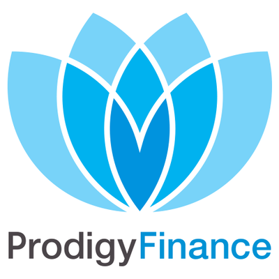
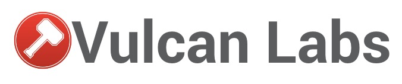

theme: Scherzkeks, 7

^ Here for RBCPT?

---

# ohai!
# :wave:

^ intros
name, what you do. alumni?
work through course, ask us Qs

---

### Goal of the day
## Build and publish a web application
## Build (and publish) a profile page

^ On the internetz!
In our case, a voting system

---

## Your development set up
# Text editor, Terminal, Browser

  

^ Write Code
Issue Commands
See the Results

---

# To the wall!
# 🏃

^ activity-printables/intro*.pdf sets

---

### Why are we here?

## Diversity in Cape Town tech
## Programming skills: useful, empowering, fun

^ People making the software should reflect the people using it
Especially on the web

---

# Code of Conduct: [rbcpt.org/code](http://rbcpt.org/code/)

---

### Open source workshop

## Community project
## Editable by anyone

^ site, docs, activities

---

### More betterer

## Make notes as you go along
## Help us improve the docs: stickies!

^ We've added: breaks; overview; glossary; lightning talk

---

### After today?

## [rbcpt.org/resources](http://rbcpt.org/resources/)
## More coding, Ruby, or Rails
## Do another RailsBridge

^ Come back and help someone new learn
Prolly Saturday 8th October, on meetup
Become a developer?

---

### Twitter
# @RailsBridgeCPT
# #railsbridge

---

### Our awesome sponsors

---

## Warm-up activity

---

# [rbcpt.org/frontend](http://rbcpt.org/frontend/)
