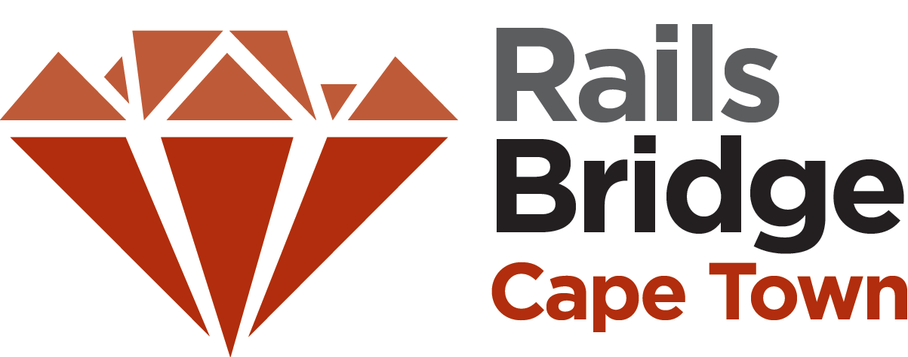
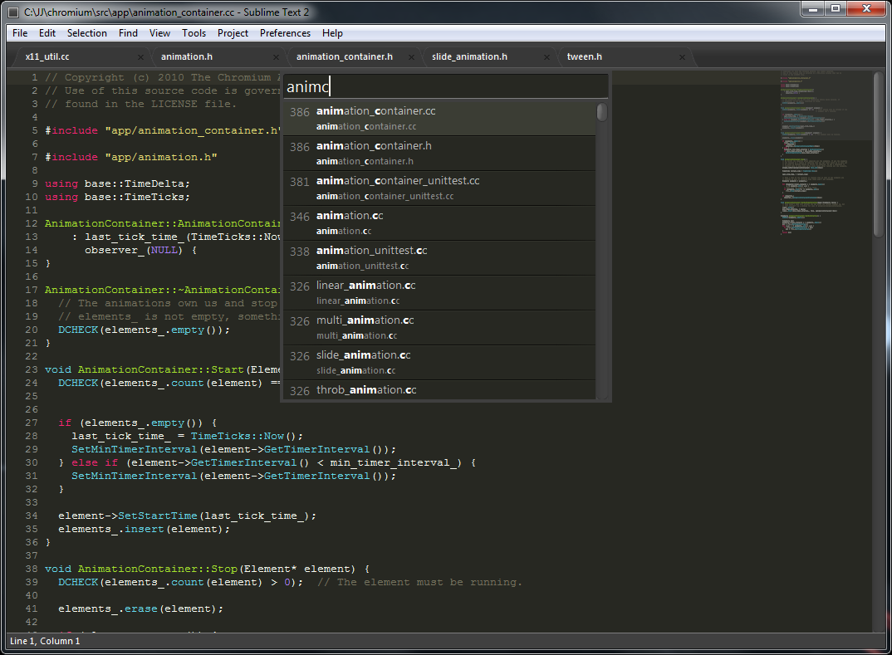
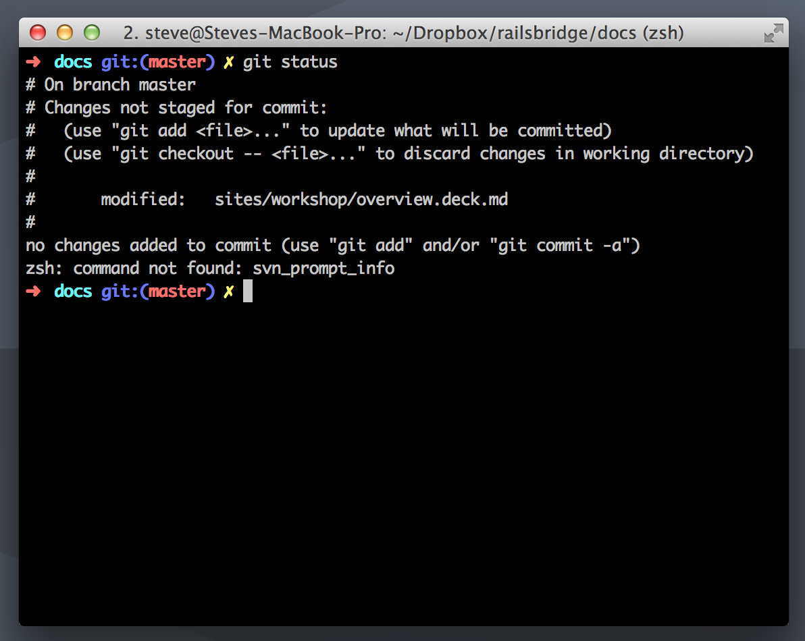
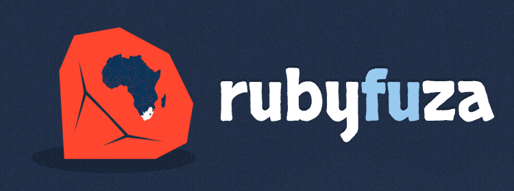

theme: Scherzkeks, 7

^ Here for RBCPT?

---

# ohai!
# 👋

^ intros
name, what you do. alumni?
work through course, ask us Qs

---

### Goal of the day
## Build (and publish) a web application
## Build (and publish) a profile page

^ On the internetz!
In our case, a voting system

---

## Your development set up
# Text editor, Terminal, Browser

  

^ Write Code
Issue Commands
See the Results

---

## InstallFest
# Download, Install, Sign Up, Check

   

^ Lots of things
All those things
For Heroku
That they work

---

# To the wall!
# 🏃

^ activity-printables/intro*.pdf sets

---

### Why are we here?

## Diversity in Cape Town tech
## Programming skills: useful, empowering, fun

^ People making the software should reflect the people using it
Especially on the web

---

### Open source workshop

## Community project
## Editable by anyone

^ site, docs, activities
not the animal stickers

---

### More betterer

## Help us improve the docs: stickies!
## Survey at the end: [rbcpt.org/out](http://rbcpt.org/out)

^ We've added: breaks; overview; glossary; lightning talk

---

### After today?

## [rbcpt.org/resources](http://rbcpt.org/resources/)
## More coding, Ruby, or Rails

^ Come back and help someone new learn
Become a developer?

---

### After today?

## Do another RailsBridge
## Chat on [zatech.co.za](http://zatech.co.za) Slack

^ About 3 months time
Ask Qs

---

### Twitter
# @RailsBridgeCPT
# #railsbridge

---

### Our awesome sponsor

---

# [fit] #letsdothis
