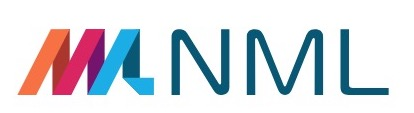
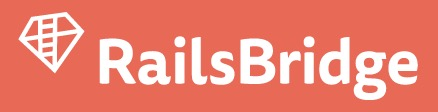
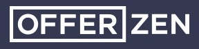

theme: Scherzkeks, 7

^ Everyone here for **this**?

---

# *ohai!*
# 👋

^ - teacher intros, special name tags
- name, what you do. alumni?

---

## *Today's goal*
# Build a thing :computer:
# Publish it :rocket:

^ - On the internetz!
- A voting system or a profile page
- work through course, ask us Qs

---

# *Your development set up*
# Text editor, Terminal, Browser

  

^ - Write Code
- Issue Commands
- See the Results

---

# *InstallFest*
# Download, Install, Sign Up, Check

   

---

## *Why are we here?*

## Diversity in Cape Town tech
## Programming skills: useful, empowering, fun

^ - People making the software should reflect the people using it
- Especially on the web

---

# *Code of Conduct*
# [rbcpt.org/code](http://rbcpt.org/code/)

^ - Short version: be welcoming, inclusive, friendly
- Longer version at that URL

---

## *Open source workshop*
## Help us make it better! :raised_hands:

^ - site, docs, activities
- We've added: breaks; overview; glossary; lightning talk
- 2 question survey at the end

---

## *After today*

## More RailsBridge?
## More coding, Ruby, or Rails?

^ - Our resources page
- Come back and help someone new learn
- Become a developer?

---

# *Sponsors* (We :heart: you so much!)

---

# :point_right: Intro to Rails?
# Front-end? :point_left:
