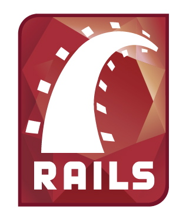

^ intros
name, what you do

---

### Schedule for the day

## 10.30am - Break
## 12.30pm - Lunch
## 3pm - Break

---

## InstallFest
# Download, Install, Sign Up, Check

   

^ Lots of things
All those things
For Heroku
That they work

---

## Workshop
# Ruby, Rails, Git, Heroku

   

^ A programming Language
A Framework: patterns for building web apps
A source control system
A hosting platform

---

# How do they fit together?

  

^ Code
Save
Publish

---

## Your development set up
# Text editor, Terminal, Browser

  

^ Write Code
Issue Commands
See the Results

---

### Why are we here?

## Diversity in Cape Town tech
## Programming skills: useful, empowering, fun

^ People making the software should reflect the people using it
Especially on the web

---

# Code of Conduct: [rbcpt.org/code](http://rbcpt.org/code/)

^ short version: be nice

---

### Open source workshop

## Community project
## Editable by anyone

^ site, docs, activities

---

### Goal of the day
## Build and publish a web application
## On the internetz!

^ In our case, a voting system

---

### The Rails Philosopy

## Opinionated
## Convention over configuration
## Minimal code - maximal effect

---

### After today?

## [rbcpt.org/resources](http://rbcpt.org/resources/)
## More coding, Ruby, or Rails
## Do another RailsBridge

---

## Help us improve the docs: stickies!
## @RailsBridgeCPT #railsbridge

---

# [fit] [rbcpt.org/install](http://rbcpt.org/install/)
