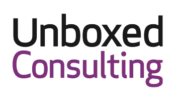

---

### Schedule for the day

## 11am Break
## 1pm Lunch
## 3pm Break

---

## Our awesome sponsors

---

### Open source workshop

## Community project
## Editable by anyone

^ github.com/RailsBridge-CapeTown

---

### Survey

## We want to make it more betterer
## Make notes as you go along

^ Some things we've added: extra credit; diagrams; sponsors; breaks; overview; glossary; resources page; lightning talks

---

### Why are we here?

## Diversity in Cape Town tech
## Programming skills: useful, empowering, fun

^ Especially on the web

---

### Goal of the day
## Build and publish a web application
## On the internetz!

^ In our case, a voting system

---

# What will you learn today?

   

^ A programming Language
A Framework: patterns for building web apps
A source control system
A hosting platform

---

# How do these fit together?

  

^ Code
Save
Publish

---

## Your development set up
# Text editor, Terminal, Browser

  

^ Write Code
Issue Commands
See the Results

---

### The Rails Philosophy

## Opinionated
## Convention over configuration
## Minimal code - maximal effect

---

### After today?

## [rbcpt.org/resources](http://rbcpt.org/resources/)
## More coding, Ruby, or Rails
## Do another RailsBridge

^ Become a developer?

---

# [fit] [rbcpt.org/start](http://rbcpt.org/start/)
